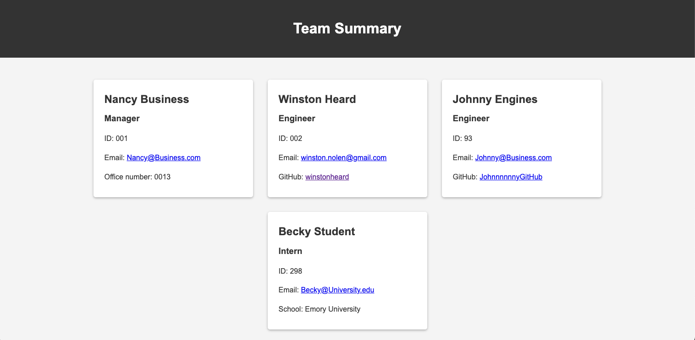

# Team profile generator
A Node.js command-line application that takes in information about employees on a software engineering team and generates an HTML webpage that displays summaries for each person.

## Table of Contents

- [Description](#description)
- [Installation](#installation)
- [Usage](#usage)
- [Video](#video)
- [Screenshot](#screenshot) 
- [Contributing](#contributing)
- [Tests](#tests)
- [Questions](#questions)

## Description

- AS A manager
- I WANT to generate a webpage that displays my team's basic info
- SO THAT I have quick access to their emails and GitHub profiles

## Installation

This project makes use of Inquirer, Jest and Node.js. Run the command npm i inquirer@8.2.4 to install both Inquirer and Jest, which is used to run the tests.

## Usage

- GIVEN a command-line application that accepts user input
- WHEN I am prompted for my team members and their information
- THEN an HTML file is generated that displays a nicely formatted team roster based on user input
- WHEN I click on an email address in the HTML
- THEN my default email program opens and populates the TO field of the email with the address
- WHEN I click on the GitHub username
- THEN that GitHub profile opens in a new tab
- WHEN I start the application
- THEN I am prompted to enter the team manager’s name, employee ID, email address, and office number
- WHEN I enter the team manager’s name, employee ID, email address, and office number
- THEN I am presented with a menu with the option to add an engineer or an intern or to finish building my team
- WHEN I select the engineer option
- THEN I am prompted to enter the engineer’s name, ID, email, and GitHub username, and I am taken back to the menu
- WHEN I select the intern option
- THEN I am prompted to enter the intern’s name, ID, email, and school, and I am taken back to the menu
- WHEN I decide to finish building my team
- THEN I exit the application, and the HTML is generated

## Video

[Recording](https://drive.google.com/file/d/1jztnLUd8Ewwf701MWp84b0qfV4UD9fZB/view)

## Screenshot

## License

This project is licensed under the MIT License. 

For more information, please visit [https://opensource.org/licenses/MIT](https://opensource.org/licenses/MIT).

## Contributing

Please contact via email for any suggestions for improvements. 

## Tests

n/a

## Questions

If you have any questions or need additional information, feel free to contact me:

- GitHub: [winstonheard](https://github.com/winstonheard)
- Email: winston.nolen@gmail.com